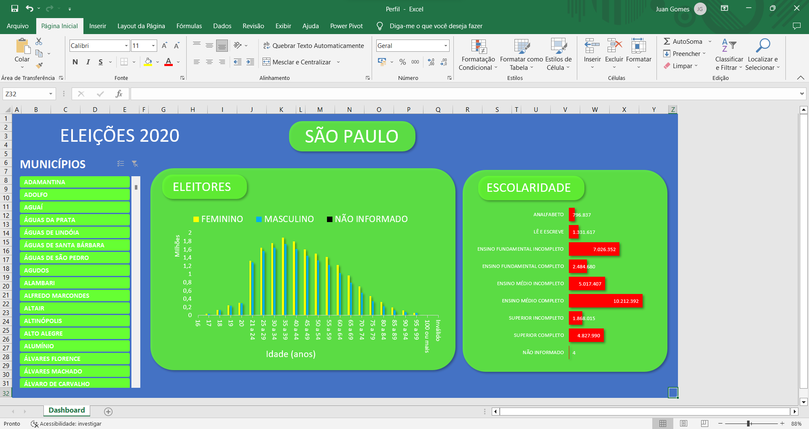
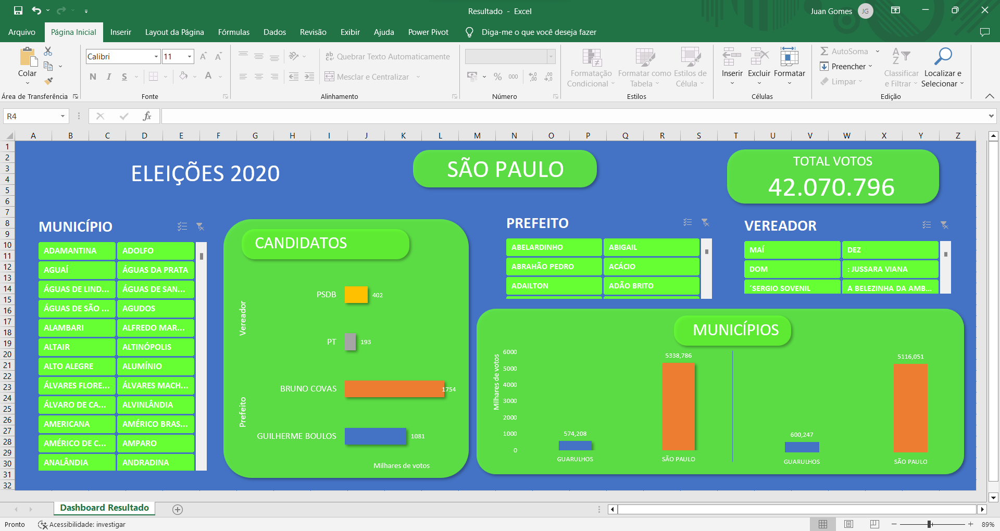

EXCEL 

Tabela Eleitores

Utilizado o Power Query, importando o arquivo .csv ao Excel. Configurado como Latino 1
Selecionado somente o município, gênero, idade, escolaridade e a quantidade de eleitores em cada perfil.
Substituido "anos" e "ou mais" por " ", na coluna idade.
2 Tabelas dinamicas realizadas com segmentação nos municícpios. 1 Quantidade de eleitores em determinada faixa etaria por gênero. 2 Quantidade de eleitores por nivel de escolaridade.
Escolhendo os seus respectivos graficos
Montagem do DashBoard

Tabela Resultados

Utilizado o Power Query, importando o arquivo .csv ao Excel. Configurado como Latino 1
3 Tabelas dinâmicas. 1 Quantidade de votos por candidato/partido, com segmentação pelos municípios, filtrados exibindo somente a os dois primeiros. 2 Soma dos votos de prefeito por município com segmentação filtrada aos prefeitos. 3 Soma dos votos de vereadores por município com segmentação filtrada aos vereadores. Filtradas para os dois primeiros
Montagem do Dashboard
Escolhendo os seus respectivos graficos

